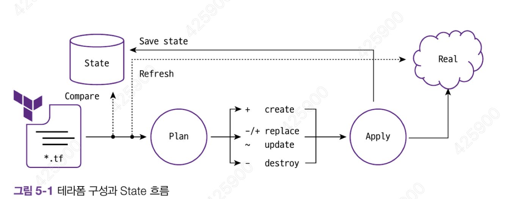
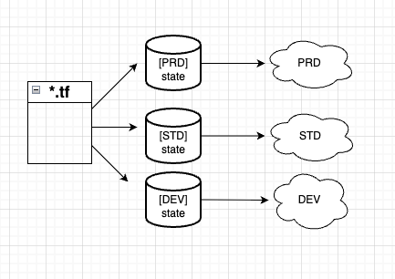

## CHAPTER 5 State

> 테라폼은 Stateful (상태가 있는) 애플리케이션이다. 프로비저닝 결과에 따른 State를 저장하고 프로비저닝한 모든 내용을 저장된 상태로 추적한다.
> 로컬 실행 환경에서는 `terraform.tfstate` 파일에 JSON 형태로 저장되고, 팀이나 조직에서의 공동 관리를 위해서는 원격 저장소에 저장해 공유하는 방식을 활용한다.
> State에는 작업자가 정의한 코드와 실제 반영된 프로비저닝 결과를 저장하고, 이 정보를 토대로 이후의 리소스 생성, 수정, 삭제에 대한 동작 판단 작업을 수행한다.

### 5.1 State의 목적과 의미

> 코드 변경 후 `terraform apply` -> 이전에 생성된 리소스와 비교해 생성, 수정, 삭제 동작이 수행됨을 확인했다. 테라폼은 State를 사용해 대상 환경에서 어떤 리소스가 테라폼으로 관리되는지 판별하고 결과를 기록한다.

- State에는 테라폼 구성과 실제를 동기화하고 각 리소스에 고유한 아이디(리소스 수조)로 맵핑
- 리소스 종속성과 같은 메타데이터를 저장하고 추적
- 테라폼 구성으로 프로비저닝된 결과를 캐싱하는 역할을 수행

```
resource "random_password" "password" {
  length = 16
  special = true
  override_special = "!#$%"
}
{
  "version": 4,
  "terraform_version": "1.14.0",
  "serial": 1,
  "lineage": "7a3efe4a-36ed-0704-f3f5-206dab066eb3",
  "outputs": {},
  "resources": [
    {
      "mode": "managed",
      "type": "random_password",
      "name": "password",
      "provider": "provider[\"registry.terraform.io/hashicorp/random\"]",
      "instances": [
        {
          "schema_version": 3,
          "attributes": {
            "bcrypt_hash": "$2a$10$2S8OtIZ4spJdHwIynu/sTOWq5wK7w84Qjhml1FY7NLKMzZEwEKeNu",
            "id": "none",
            "keepers": null,
            ...생략

```

- 테라폼에서는 이 JSON 형태로 작성된 State를 통해 속성과 인수를 읽고 확인할 수 있다.
- 테라폼에서는 type과 name으로 고유한 리소스를 분류하며, 해당 리소스의 속성과 인수를 구성과 비교해 대상 리소스를 생성, 수정, 삭제한다.

> State는 테라폼만을 위한 API로 정의할 수 있다. Plan을 실행하면 암묵적으로 refresh 동작을 수행하면서 리소스 생성의 대상과 State를 기준으로 비교하는 과정을 거친다.
> 이 작업은 프로비저닝 대상의 응답 속도와 기존에 작성된 State의 리소스 양에 따라 속도 차이가 발생한다.
> 대량의 리소스를 관리해야 하는 경우 Plan 명령에서 -refresh=false 플래그를 사용하여 State를 기준으로 실행계뢱을 생성하고, 이를 실행에 활용해 대상 환경과의 동기화 과정을 생략할 수 있음.

### 5.2 State 동기화

> 테라폼 구성 파일은 기존 State와 구성을 비교해 실행 계획에서 생성, 수정, 삭제 여부를 결정한다.
> 

다음은 Plan과 Apply 중 각 리소스에 발생할 수 있는 네 가지 사항이다. Replace 동작은 기본값을 삭제 후 생성하지만 lifecycle의 create_before_destroy 옵션을 통해 생성 후 삭제를 수행하도록 설정할 수 있다.

| 기호 | 의미             |
| ---- | ---------------- |
| +    | Create           |
| -    | Destroy          |
| -/+  | Replace          |
| ~    | Update in-plance |

태라폼 구성에 추가된 리소스와 State에 따라 어떤 동작이 발생하는지 다음표로 살펴보자

| 유형 | 구성 리소스 정의 | State의 구성 데이터 | 실제 리소스 | 기본 예상 동작 |
| ---- | ---------------- | ------------------- | ----------- | -------------- |
| 1    | 있음             |                     |             | 리소스 생성    |
| 2    | 있음             | 있음                |             | 리소스 생성    |
| 3    | 있음             | 있음                | 있음        | 동작 없음      |
| 4    |                  | 있음                | 있음        | 리소스 삭제    |
| 5    |                  |                     | 있음        | 동작 없음      |

#### 5.2.1 유형1

> 테라폼 구성 파일에 신규 리소스를 정의하고 Apply를 수행하면 State에 없는 리소스이므로 생성 작업을 수행한다.

```
### 5.2.1
resource "local_file" "foo" {
  content = "foo"
  filename = "${path.module}/foo.bar"
}
```

terraform.tfstate에서 프로비저닝의 결과로 생성된 foo.txt 파일과 관련된 내용이 State에 생성된다.

#### 5.2.2 유형2

> 테라폼 구성 파일에 리소스가 있고 `State`에도 관련 구성 내용이 있지만 실제 리소스가 없는 경우 생성 작업을 수행한다.
> 이 같은 상황은 테라폼으로 프로비저닝을 완료 했지만 사용자가 수동으로 인프라를 삭제한 경우에도 해당된다.
> 유형 1에서 생성된 실제 리소스인 `foo.txt` 파일을 강제로 삭제하고 다시 `terraform plan`을 수행한다.
> 실행 계획 작성을 위해 실제 리소스와의 `Refresh` 동작을 수행해 `State와` 비교한다.
> 실제 리소스를 삭제한 후 테라폼의 `Plan과` `Apply를` 실행하면 다시 생성할 것으로 실행 계획이 발생한다.

```
terraform plan
...생략...
Plan: 1 to add, 0 to change, 1 to destroy.
```

- 주의할 점은 CI/CD 설계 시 앞서 확인한 -refresh=false 인수를 추가해 Plan을 실행한 경우 State만을 확인하므로 이미 생성되었다고 판단해, 실제 리소스를 다시 만드는 작업은 발생하지 않는다는 것이다.

```
terraform plan -refresh=false
...생략...
No changes. Your infrastructure matches the configuration.
```

#### 5.2.3 유형3

> 테라폼 구성에 정의된 리소스로 생성된 프로비저닝 결과가 `State`에 있고 실제 리소스도 있는 경우라면 테라폼은 관련 리소스에 대한 변경 계획을 발생시키지 않는다. 유형 2에 다시 terraform apply를 수행해 프로비저닝 결과가 있는 경우 terraform plan으로 실행 계획을 생성하면 변경 사항은 없다. 코드, State, 형상이 모두 일치하는 상태다.

```
➜  5.1 git:(main) ✗ terraform apply -auto-approve
...생략...
Apply complete! Resources: 1 added, 0 changed, 0 destroyed.

➜  5.1 git:(main) ✗ terraform apply -auto-approve
...생략...
No changes. Your infrastructure matches the configuration.
```

#### 5.2.4 유형 4

> 구성, State, 실제 리소스가 있는 상태에서 테라폼에서 정의한 리소스 구문을 삭제하면 사용자는 의도적으로 해당 리소스를 삭제하는 것이다. 테라폼은 구성 파일을 기준으로 State와 비교해 삭제된 구성을 실제 리소스에서 제거한다. main.tf에서 리소스를 주석처리하고 terraform plan을 실행하면 없어진 코드 선언을 삭제하려는 계획을 작성한다.

```
➜  5.1 git:(main) ✗ terraform plan
local_file.foo: Refreshing state... [id=0beec7b5ea3f0fdbc95d0dd47f3c5bc275da8a33]

Terraform used the selected providers to generate the following execution plan. Resource actions are indicated with the
following symbols:
  - destroy

Terraform will perform the following actions:

  # local_file.foo will be destroyed
  # (because local_file.foo is not in configuration)
  - resource "local_file" "foo" {
      - content              = "foo" -> null
      - content_base64sha256 = "LCa0a2j/xo/5m0U8HTBBNBNCLXBkg7+g+YpeiGJm564=" -> null
      - content_base64sha512 = "9/u6bgY2+JDlb7vzKD5STG+jIErimDgtYkdB0NxmODJuKCxBvl5CVNiCB3LFUYosWowMf37aGVlKfrU5RT4e1w==" -> null
      - content_md5          = "acbd18db4cc2f85cedef654fccc4a4d8" -> null
      - content_sha1         = "0beec7b5ea3f0fdbc95d0dd47f3c5bc275da8a33" -> null
      - content_sha256       = "2c26b46b68ffc68ff99b453c1d30413413422d706483bfa0f98a5e886266e7ae" -> null
      - content_sha512       = "f7fbba6e0636f890e56fbbf3283e524c6fa3204ae298382d624741d0dc6638326e282c41be5e4254d8820772c5518a2c5a8c0c7f7eda19594a7eb539453e1ed7" -> null
      - directory_permission = "0777" -> null
      - file_permission      = "0777" -> null
      - filename             = "./foo.txt" -> null
      - id                   = "0beec7b5ea3f0fdbc95d0dd47f3c5bc275da8a33" -> null
    }

Plan: 0 to add, 0 to change, 1 to destroy.
```

#### 5.2.5 유형 5

> 이미 만들어진 리소스만 있다면 테라폼의 State에 없는 내용이므로 테라폼으로 관리되지 않는다. 따라서 해당 리소스에 대해서는 아무 작업도 수행할 수 없다.

- 처음부터 테라폼으로 관리되지 않는 리소스인 경우
- 테라폼으로 생성하고 구성과 State가 삭제된 경우

테라폼으로 관리되지 않는 리소스인 경우를 관리하는 방법은 9.2절에서 다룬다.

### 5.3 워크스페이스

> State를 관리하는 논리적인 가상 공간을 워크스페이스라고 한다. 테라폼 구성 파일은 동일하지만 작업자는 서로 다른 State를 갖는 실제 대상을 프로비저닝할 수 있다. 워크스페이스는 기본 default로 정의된다. 로컬 작업 환경의 워크스페이스 관리를 위한 CLI 명령으로 workspace가 있다.



> 기본 사용법: terrafomr [global options] workspace

사용 중인 워크스페이스 확인을 위해 terraform workspace list 명령으로 확인해보면 기본 default 외에 다른 워크스페이스는 없고 사용 중인 워크스페이스임을 나타내기 위해 앞에 \* 기호가 붙어 있다.

```
➜  terraform git:(main) terraform workspace list
* default
```

- `State`가 워크스페이스상에서 관리되는 방식을 확인하기 위해 다음 페이지의 [코드 5-4] 처럼 main.tf를 새로 작성
- `terraform init`과 `terraform apply`를 수행해 `default` 워크스페이스의 테라폼 리소스를 생성한다.
- `terraform plan`을 다시 수행하면 구성에 변경이 없고 State의 리소스 구성 정보가 같으므로 변경 사항이 없다는 메시지를 출력할 것이다.

```
# AWS 프로바이더 선언 생략
resource "aws_instance" "web" {
  ami = "ami-0c55b159cbfafe1f0"
  instance_type = "t3.micro"

  tags = {
    Name = "HelloWorld"
  }

}

➜  5.1 git:(main) ✗ terraform workspace new myworkspace1
Created and switched to workspace "myworkspace1"!
```

새로운 워크스페이스가 생성되면 실행한 루트 모듈 디렉토리에 terraform.tfstate.d 디렉토리가 생성되고 하위에 생성한 워크스페이스 이름이 있는 것을 확인가능

```
➜  5.1 git:(main) ✗ terraform workspace show
myworkspace1
```

- `plan`을 수행하면 새로 생성한 워크스페이스에서는 기존 default 워크 스페이스에서 관리하는 State와 독립된 정보를 갖기 때문에 앞서 정의한 테라폼 구성의 리소스를 다시 생성하겠다고 출력함

- `terraform apply`를 수행해 결과 확인 -> terraform.tfstate.d의 워크 스페이스의 이름의 디렉토리에 새로운 terraform.tfstate가 생성됨을 확인할 수 있다.
  이렇게 워크스페이스를 구분하면 동일한 구성에서 기존 인프라에 영향을 주지 않으면서 간편하게 테라폼 프로비저닝을 테스트하고 확인할 수 있다. 또한 테라폼 구성에서 terraform.workspace를 사용하여 워크스페이스 이름을 읽으면 워크스페이스 기준으로 문자열을 지정하거나 조건을 부여할 수 있음.

```
resource "aws_instance" "web" {
  count = "${terraform.workspace == "default" ? 5: 1}"
  ami = "ami-0c55b159cbfafe1f0"
  instance_type = "t3.micro"

  tags = {
    Name = "HelloWorld-${terraform.workspace}"
  }

}
```

- `Plan`과 `Apply` 단계에서 특정 워크스페이스의 State를 지정할 수 있다. default 워크스페이스로 전환하고 생성한 워크스페이스의 State를 지정해 destroy를 실행한다.
- `yes`를 입력하기전에 지정한 State와 같은 위치에 .terraform.tfstate.lock.info가 생성되는 것을 확인해본다.
- 삭제 후 State를 지정하지 않고 destroy를 수행하면 현재 지정된 default 워크스페이스의 State를 읽으므로 다시 삭제할 대상이 나타난다.

> 다수의 워크스페이스 사용시 장점

- 하나의 루트모듈에서 다른 환경을 위한 리소스를 동일한 테라폼 구성으로 프로비저닝하고 관리
- 기존 프로비저닝된 환경에 영향을 주지 않고 변경 사항 실험 가능
- 깃의 브랜치 전략처럼 동일한 구성에서 서로 다른 리소스 결과 관리

> 다수의 워크스페이스 사용시 단점

- State가 동일한 저장소(로컬 또는 백엔드)에 저장되어 State 접근 권한 관리가 불가능
- 모든 환경이 동일한 리소스를 요구하지 않을 수 있어 테라폼 구성에 분기 처리가 다수 발생할 수 있음
- 프로비저닝 대상에 대한 인증 요소를 완벽히 분리하기 어려움

> 워크스페이스의 단점은 완벽한 격리가 불가능하다는 점.
> 이 문제는 운영 환경을 위한 구성 또는 다수의 구성원이 테라폼으로 프로비저닝을 하는 상황에서 불거진다.
> 해결하기 위해 루트 모듈을 별도로 구성하는 디렉토리 기반의 레이아웃을 사용할 수 있음.
> 시스템적으로 보완하기 바란다면 HCP Terraform 환경의 워크스페이스를 활용하는 쪽을 권장한다.
